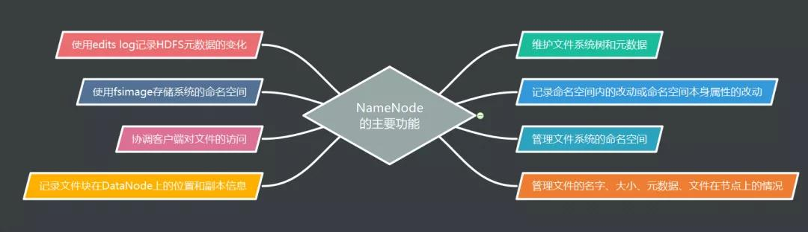
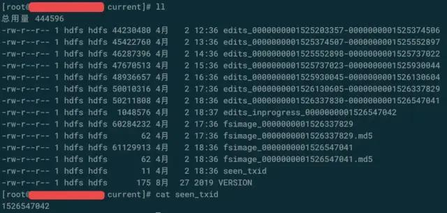
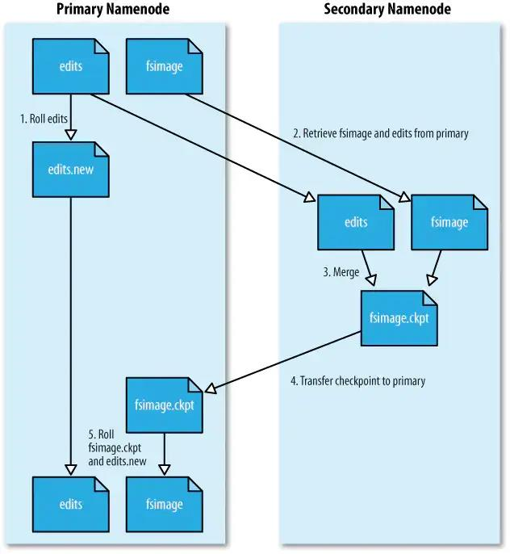
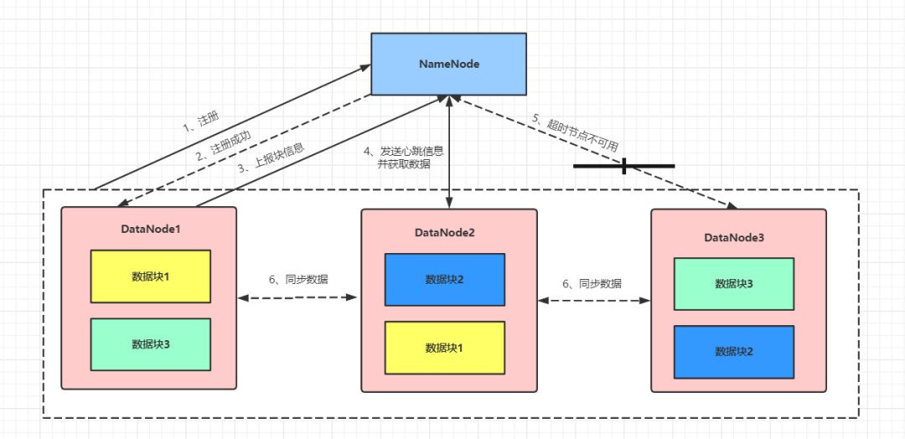
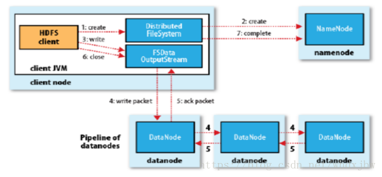
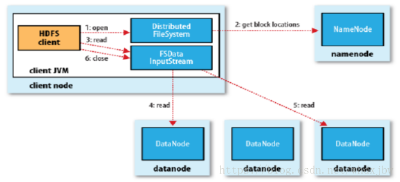
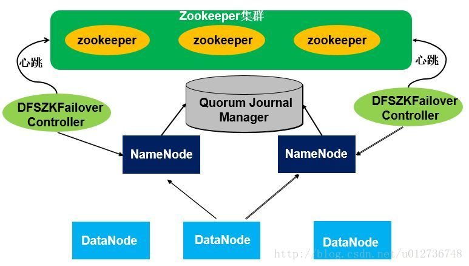
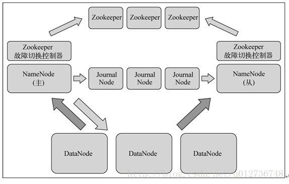
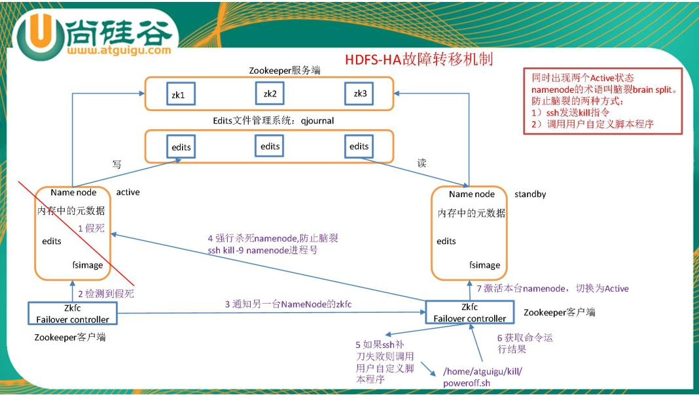
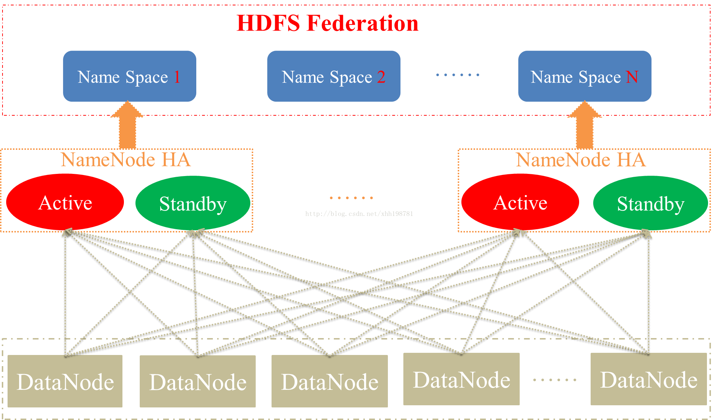

# 1. 什么是HDFS

HDFS(Hadoop Distributed File System)是一个分布式的文件系统，在廉价的硬件资源上即可运行。与现有的分布式文件系统相比有一些重要的特点：HDFS具有高容错性、运行在廉价硬件资源，对应用数据具有高吞吐量，适合用在海量数据存储、读取。其设计的目标是：

* 硬件故障自动恢复(容错性)  
  硬件故障异常是比较常见的一种集群故障。一个HDFS集群可能包含数千服务器组成，每个服务器数据节点存储了文件系统数据的一部分，当其中的某些节点出现硬件故障时将会影响到HDFS正常的工作，因此，检测故障并快速的、自动的从故障中恢复是HDFS设计的核心。

* 流式数据访问  
  在HDFS上运行的应用程序需要对数据集进行流式访问，HDFS设计主要用于数据的批处理，而不是与用户交互使用，其重点在强调数据访问的高吞吐而不是数据低延迟访问。
  关于流概念的区别,原文地址:<https://mp.weixin.qq.com/s/cn7-JmdlYZsJFqFgUnkjeQ>
  >流式数据：理解为不是一次性加载完的数据，比如看电影，数据是一帧一帧过来的，动态的；
  >实时数据：实时产生的数据，和流式数据区别不大，有时候也会叫做实时流数据；
  >实时计算：处理实时数据，区别与离线计算（处理历史数据）；
  >流式计算：这与实时计算不应该一起比较，实时计算强调的是数据的实时性，而流式计算强调的是计算方法，理解为 Java8 中的流式数据处理；

* 大文件数据  
  HDFS通常用于大文件数据的处理，一般的文件大小都在GB甚至到TB级，对于小文件处理应当先进行合并、聚合，然后使用HDFS进行存储以提升吞吐量。

* 数据一致性模型  
  HDFS应用程序对于一个文件的访问当遵循**write-once-read-many**原则，一个文件一旦创建并写入数据，那么该文件只能在文件末尾追加，而不能够在任意位置进行修改。

* 移动计算优于数据移动(Moving Computation is Cheaper than Moving Data)  
  通常在应用程序请求进行计算时，根据数据的本地性或数据邻近节点(就近原则)进行程序分发，尽可能的少移动数据。这样将能够提升计算效率，应用程序的远程传输的IO比数据网络IO的开销低很多。
* 跨平台移植  
  HDFS的设计目的是可以轻松地从一个平台移植到另一个平台。 这有助于将HDFS广泛用作大量应用程序的首选平台。

# 2.HDFS架构及其主要概念

原文地址：<https://mp.weixin.qq.com/s/tXe-ZLch1M7_zJcBSqQkVQ>

HDFS的架构采用主从架构模式，其中Master为NameNode，Slave为DataNode。如下图所示：


（1）客户端向NameNode发起请求，获取元数据信息，这些元数据信息包括命名空间、块映射信息及 DataNode 的位置信息等。
（2）NameNode 将元数据信息返回给客户端。
（3）客户端获取到元数据信息后，到相应的 DataNode 上读/写数据
（4）相关联的 DataNode 之间会相互复制数据，以达到 DataNode 副本数的要求
（5）DataNode 会定期向 NameNode 发送心跳信息，将自身节点的状态信息报告给 NameNode。
（6）SecondaryNameNode 并不是 NameNode 的备份。SecondaryNameNode 会定期获取 NameNode 上的 fsimage和 edits log 日志，并将二者进行合并，产生 fsimage.ckpt 推送给 NameNode。

以下将简略描述各个组件的功能：  

* NameNode
  * 负责维护文件系统名称空间，记录对名称空间或其属性的任何更改。
    > HDFS的文件系统名称空间与Linux的文件系统类似，支持目录和文件的创建、移动、删除和重命名操作，支持用户权限配置，但不支持硬链接和软连接。
  * 集群数据文件元数据的管理，记录了文件各个Block的位置信息。
* DataNode
  * 用于实际数据的存储，负责数据的读写；
  * 数据节点周期性向Namenode汇报自己节点上所存储的Block相关信息。
* Client
  * 客户端程序用于读写HDFS上的文件，一般将启用多个实例。
  * 文件切分。文件上传 HDFS 的时候，Client 将文件切分成 一个一个的Block，然后进行存储。
  * 与 NameNode 交互，获取文件的位置信息。
  * 与 DataNode 交互，读取或者写入数据。
  * Client 提供一些命令来管理 HDFS，比如启动或者关闭HDFS。
  * Client 可以通过一些命令来访问 HDFS。
  > 来源：<https://blog.csdn.net/kezhong_wxl/article/details/76573901>
* Block  
  HDFS以Block为基本的操作单元，默认的Block的大小为128M。为了充分的利用存储空间，HDFS文件将Block拆分为chunk作为独立单元存储。这样一个文件块如果小于了128M，那么仅占用实际的大小，而不是块大小128M。
* SecondaryNameNode  
  主要职责是执行checkpoint操作，每隔一段时间会由SecondaryNamenode将NameNode上持久化的所有editslog和一个最新的fsimage下载到本地，并加载到内存进行merge（这个过程称为checkpoint)，这样可以减少NameNode在加载fsimage到内存的时间。

## 2.1 NameNode

NameNode 是整个 Hadooop 集群中至关重要的组件，它维护着整个 HDFS 树，以及文件系统树中所有的文件和文件路径的元数据信息。这些元数据信息包括文件名，命令空间，文件属性（文件生成的时间、文件的副本数、文件的权限）、文件数据块、文件数据块与所在 DataNode 之间的映射关系等。一旦 NameNode 宕机或 NameNode 上的元数据信息损坏或丢失，基本上就会丢失 Hadoop 集群中存储的所有数据，整个 Hadoop 集群也会随之瘫痪.

在 Hadoop 运行的过程中， NameNode 的主要功能如下图所示：



## 2.2 SecondaryNameNode

以下内容来自文章:
（1）<https://mp.weixin.qq.com/s/w9_qWjaeWW3jl_tm93Rlhw>
（2）<https://www.jianshu.com/p/5b4dd843b29d>
（3）<https://mp.weixin.qq.com/s/oIs2iQvoCUBolrWKxDJDIA>

SecondaryNameNode 并不是 NameNode 的备份，在NameNode 发生故障时也不能立刻接管 NameNode 的工作。SecondaryNameNode 在 Hadoop 运行的过程中具有两个作用：**一个是备份数据镜像，另一个是定期合并日志与镜像**，因此可以称其为 Hadoop 的检查点（checkpoint）。
SecondaryNameNode 定期合并 NameNode 中的 fsimage 和 edits log，能够防止 NameNode 重启时把整个 fsimage 镜像文件加载到内存，耗费过长的启动时间。
符号说明：SecondaryNameNode简称SNN；NameNode简称NN

### 2.2.1 NN与fsimage、edits文件

NN负责管理HDFS中所有的元数据，包括但不限于文件/目录结构、文件权限、块ID/大小/数量、副本策略等等。客户端执行读写操作前，先从NN获得元数据。存储数据的方式来看，要么放到内存中，要么放到磁盘上。HDFS作为一个分布式存储服务，需要处理客户端大量的CRUD请求:

* 元数据放入内存中，可以进行高效的数据查询以快速响应客户端的请求，如果namenode发生故障，则元数据会丢失
* 元数据放入磁盘中，安全性较高但是无法快速响应客户端的请求.

综上，HDFS采用了**内存+磁盘**的方式进行元数据的管理，即内存->NameNode节点内存，磁盘->Fsimage文件。并且为了保证元数据在增删改操作下，内存和磁盘中元数据的一致性及操作效率.NN内部有两类文件用于持久化元数据：

* **fsimage文件**，以fsimage_为前缀，是序列化存储的元数据的整体快照
* **edits文件**（又称edit log），以edits_为前缀，是顺序存储的元数据的增量修改（即客户端写入操作）日志。
这两类文件均存储在${dfs.namenode.name.dir}/current/路径下，如下图所示。


可见，当前正在写入的edits文件名会有"inprogress"标识，而seen_txid文件保存的就是当前正在写入的edits文件的ID。
在任意时刻，最近的fsimage和edits文件的内容加起来就是全量元数据。NN在启动时，就会将最近的fsimage文件加载到内存，并重放它之后记录的edits文件，恢复元数据的现场.

### 2.2.2 SNN与checkpoint过程

为了避免edits文件过大，以及缩短NN启动时恢复元数据的时间，我们需要定期地将edits文件合并到fsimage文件，该合并过程叫做checkpoint。由于NN的负担已经比较重，再让它来进行I/O密集型的文件合并操作就不太科学了，所以Hadoop引入了SNN负责这件事。也就是说，**SNN是辅助NN进行checkpoint操作的角色**。

checkpoint的触发由hdfs-site.xml中的两个参数来控制。

* **dfs.namenode.checkpoint.period**：触发checkpoint的周期长度，默认为1小时。
* **dfs.namenode.checkpoint.txns**：两次checkpoint之间最大允许进行的操作数，默认为100万。

只要满足上述两个参数的条件之一，就会触发checkpoint过程，过程如下：

* （1）SNN会通知NN生成新的edits_inprogress文件日志文件,NN将新的日志信息写入该文件中，之前正在写的edits文件即为待合并状态。
* （2）将待合并的edits文件和fsimage文件一起复制到SNN本地。此时使用的是 http get 方式。
* （3）SNN像NN启动时一样，将fsimage文件加载到内存，并执行edits日志文件中的操作，生成新的fsimage，其名称为fsimage.ckpt。
* （4）SNN将fsimage.ckpt文件发送到NN，此时使用的是 http post 方式。
* （5）NN在获取得到fsimage.ckpt文件后，将edits_inprogress文件命名为新生成的edit.log文件，同样将fsimage.ckpt命名为fsimage。NN将更新fsimage，将此次执行 checkpoint 的时间写入 fstime 文件中。

经过 SecondaryNameNode 对 fsimage 镜像文件和 edits log 日志文件的复制和合并操作之后，NameNode 中的 fsimage 镜像文件就保存了最新的 checkpoint 的元数据信息， edits log 日志文件也会重新写入数据，两个文件中的数据不会变得很大。因此，当 重启 NameNode 时，不会耗费太长的启动时间。

Hadoop官方给出的图示如下。虽然文件名称不同，但思想是一样的。


>**如果开启了NN高可用呢？**
上面说的都是集群只有一个NN的情况。如果有两个NN并且开启了HA的话，SNN就没用了。checkpoint过程会直接交给Standby NN来负责。Active NN会将edits文件同时写到本地与共享存储（QJM方案就是JournalNode集群）上去，Standby NN从JournalNode集群拉取edits文件进行合并，并保持fsimage文件与Active NN的同步。
> 如果 NameNode 发生故障或 NameNode 上的元数据信息丢失或损坏导致 NameNode 无法启动，此时就需要人工干预，将 NameNode 中的元数据状态恢复到 SecondaryNameNode 中的元数据状态。此时，如果 SecondaryNameNode 上的元数据信息与 NameNode 宕机时的元数据信息不同步，则或多或少地会导致 Hadoop 集群中丢失一部分数据。出于此原因，**应尽量避免将 NameNode 和 SecondaryNameNode 部署在同一台服务器上**.

## 2.3 DataNode

DataNode 是真正存储数据的节点，这些数据以数据块的形式存储在 DataNode 上。一个数据块包含两个文件：一个是存储数据本身的文件，另一个是存储元数据的文件（这些元数据主要包括数据块的长度、数据块的检验和、时间戳）。

DataNode 运行时的工作机制如图所示：



DataNode 运行时的工作机制如下：

* （1）DataNode启动之后，向 NameNode 注册。
* （2）NameNode 返回注册成功的消息给 DataNode。
* （3）DataNode 收到 NameNode 返回的注册成功的信息之后，会周期性地向 NameNode 上报当前 DataNode 的所有块信息，默认发送所有数据块的时间周期是 1h。
* （4）DataNode 周期性地向NameNode 发送心跳信息；NameNode 收到 DataNode 发来的心跳信息后，会将DataNode 需要执行的命令放入到心跳信息的返回数据中，返回给 DataNode。DataNode 向 NameNode 发送心跳信息的默认时间周期是 3s。
* （5）NameNode 超过一定的时间没有收到 DataNode 发来的心跳信息，则 NameNode 会认为对应的 DataNode 不可用。默认的超时时间是 10 min。
* （6）在存储上相互关联的 DataNode 会同步数据块，以达到数据副本数的要求。

当 DataNode 发生故障导致 DataNode 无法与 NameNode 通信时，NameNode 不会立即认为 DataNode 已经 “死亡”。要经过一段短暂的超时时长后才会认为 DataNode 已经 “死亡”。HDFS 中默认的超时时长为 10 min + 30 s，可以用如下公式来表示这个超时时长：

```Html
timeout = 2 * dfs.namenode.heartbeat.recheck-interval +10 * dfs.heartbeat.interval
```

其中，各参数的含义如下：
**timeout**：超时时长。
**dfs.namenode.heartbeat.recheck-interval**：检查过期 DataNode 的时间间隔，与 `dfs.heartbeat.interval` 结合使用，默认的单位是 ms，默认时间是 5 min。
**dfs.heartbeat.interval**：检测数据节点的时间间隔，默认的单位为 s，默认的时间是 3 s。
所以，可以得出 DataNode 的默认超时时长为 630s

当DataNode被NameNode判定为 “死亡”时，HDFS就会马上自动进行数据块的容错复制。此时，当被NameNode判定为 “死亡” 的DataNode重新加入集群中时，如果其存储的数据块并没有损坏，就会造成**HDFS上某些数据块的备份数超过系统配置的备份数目**。HDFS上删除多余的数据块需要的时间长短和数据块报告的时间间隔有关。该参数可以在 hdfs-site.xml文件中进行配置，代码如下所示：

```xml
<property>
     <name>dfs.blockreport.intervalMsec</name>
     <value>21600000</value>
     <description>Determines block reporting interval in milliseconds.</description>
</property>
```

数据块报告的时间间隔默认为 21600000ms，即 6h，可以通过调整此参数的大小来调整数据块报告的时间间隔。

# 3. HDFS实现文件管理和容错

引用文章列表：
(1) 干货 | HDFS是如何实现文件管理和容错的？(<https://mp.weixin.qq.com/s/qHbSPn-Wpxsrj0y63ePZmA>)
(2) 5000 字干货 | 大数据之 HDFS 图文详解 (<https://mp.weixin.qq.com/s/cn7-JmdlYZsJFqFgUnkjeQ>)

## 3.1 副本块存放容错机制

HDFS会将数据文件切分成一个个小的数据块进行存储，同时会将这些数据块的副本保存多份，分别保存到不同的 DataNode 上。HDFS 中数据块的副本数由 hdfs-site.xml文件中的`dfs.replication`属性决定，配置属性如下：

```xml
<property>
    <name>dfs.replication</name>
    <value>3</value>
</property>
```

Hadoop 默认的副本数为3，并且在机架的存放上也有一定的策略。Hadoop 的默认布局策略，即默认的副本存放策略如下：

* 第 1 个副本存放在 HDFS 客户端所在的节点上。
* 第 2 个副本存放在与第1个副本不同的机架上，并且是随机选择的节点。
* 第 3 个副本存放在与第2个副本相同的机架上，并且是不同的节点。

> 如果有更多的副本，则随机选择机架，每个机架的副本数量有个上限值，计算方式通常是：(replicas - 1) / racks + 2

这样存放副本策略的优点：

* 避免一个机架出故障，导致所有数据丢失；
* 同一个机架上的节点通信网络会比不同机架节点通信更好，副本2与副本3放置在同一个机架能够节省带宽. 具体原因可结合HDFS写入文件过程进行分析。

## 3.2 数据完整性安全校验

通常，在校验数据是否损坏时可以用如下方式。

（1）当数据第一次引入时，计算校验和。
（2）当数据经过一系列的传输或者复制时，再次计算校验和。
（3）对比第（1）和第（2）步的校验和是否一致，如果两次数据的校验和不一致，则证明数据已经被破坏。

>注意：这种使用校验和来验证数据的技术只能检测数据是否被损坏，并不能修复数据。

**HDFS中校验数据是否损坏使用的也是校验和技术**，无论是进行数据的写入还是进行数据的读取，都会验证数据的校验和。校验和的字节数由`core-site.xml`文件中的`io.bytes.per.checksum`属性指定，默认的字节长度为 512 B，具体配置如下：

```xml
<property>
         <name>io.bytes.per.checksum</name>
         <value>512</value>
</property>
```

* 写入数据
当HDFS写数据时，HDFS 客户端会将要**写入的数据及对应数据的校验和**发送到 DataNode 组成的复制管道中，其中最后一个 DataNode 负责验证数据的校验和是否一致。**如果检测到校验和与 HDFS 客户端发送的校验和不一致，则 HDFS 客户端 会收到校验和异常的信息，可以在程序中捕获到这个异常，进行相应的处理，如重新写入数据或者用其他方式处理。**

* 读取数据
HDFS读数据时也会验证校验和，此时会将它们与DataNode中存储的校验和进行比较。如果其与 DataNode中存储的校验和不一致，则说明数据已经损坏，需要重新从其他 DataNode 读取数据。其中，**每个DataNode都会保存一个校验和日志，客户端成功验证一个数据块之后，DataNode会更新该校验和日志。**

* 定期校验
**每个 DataNode 也会在后台运行一个扫描器（DataBlockScanner），定期验证存储在这个 DataNode 上的所有数据块。**

由于 HDFS 提供的数据块副本机制，**当一个数据块损坏时，HDFS 能够自动复制其他完好的数据块来修复损坏的数据块，得到一个新的，完好的数据块，以达到系统设置的副本数要求**，因此在某些数据块出现损坏时，保证了数据的完整性。

## 3.3 心跳机制

DataNode 会**定期向 NameNode 发送心跳信息**，将自身节点的状态告知 NameNode；NameNode 会将 DataNode 需要执行的命令放入心跳信息的返回结果中，返回给 DataNode 执行。当 DataNode 发生故障没有正常发送心跳信息时，NameNode 会**检测文件块的副本数是否小于系统设置值，如果小于设置值，则自动复制新的副本并分发到其他的 DataNode上**。

当集群中的 DataNode 发生故障而失效，或者在集群中添加新的 DataNode 时，可能会导致数据分布不均匀。**当某个DataNode上的空闲空间资源大于系统设置的临界值时，HDFS就会从其他的DataNode上将数据迁移过来**。相对地，如果某个 DataNode 上的资源出现超负荷运载，HDFS 就会根据一定的规则寻找有空闲资源的 DataNode，将数据迁移过去。

## 3.4 回收站

当从 HDFS 中删除数据时，数据并不是马上就会从 HDFS 中被删除，而是会将这些数据放到“回收站”目录中，随时可以恢复，直到超过了一定的时间才会真正删除这些数据。

## 3.5 Hadoop自身的容错

Hadoop 自身的容错理解起来比较简单，当升级 Hadoop 系统时，如果出现 Hadoop 版本不兼容的问题，可以通过**回滚Hadoop版本**的方式来实现自身的容错。

# 4. HDFS分布式文件系统优缺点总结

## 4.1 优点

* 高容错性
  * 可以由数百或数千个服务器机器组成，每个服务器机器存储文件系统数据的一部分；
  * 数据自动保存多个副本；
  * 副本丢失后检测故障快速，自动恢复。
* 适合批处理
  * 移动计算而非数据；
  * 数据位置暴露给计算框架；
  * 数据访问的高吞吐量；
  * 运行的应用程序对其数据集进行流式访问。
* 适合大数据处理
  * 典型文件大小为千兆字节到太字节；
  * 支持单个实例中的数千万个文件；
  * 10K+节点。
* 可构建在廉价的机器上
  * 通过多副本提高可靠性；
  * 提供了容错与恢复机制。
* 跨异构硬件和软件平台的可移植性强
  * 轻松地从一个平台移植到另一个平台。
* 简单一致性模型
  * 应用程序需要一次写入多次读取文件的访问模型；
  * 除了追加和截断之外，不需要更改已创建，写入和关闭的文件；
  * 简化了数据一致性问题，并实现了高吞吐量数据访问；
  * 高度可配置，具有非常适合于许多安装的默认配置。大多数时候，只需要为非常大的集群调整配置。
  
## 4.2 缺点

* 不适合低延迟的数据访问
  * HDFS设计更多的是批处理，而不是用户交互使用。重点在于数据访问的高吞吐量，而不是数据访问的低延迟。
* 不适合小文件存取
  * 占用NameNode大量内存；
  * 寻道时间超过读取时间。
* 无法并发写入、文件随即修改
  * 一个文件只能有一个写者；
  * 仅支持追加和截断.
  
# 5. HDFS读写流程

版权声明：本文为CSDN博主「bw_233」的原创文章，遵循CC 4.0 BY-SA版权协议，转载请附上原文出处链接及本声明。
原文链接：<https://blog.csdn.net/whdxjbw/article/details/81072207>

<https://mp.weixin.qq.com/s/jq0TIQfgFX18PwYp0NBDOg>

## 5.1 基本概念

### 5.1.1 Block

文件被切分成固定大小的数据块，默认数据块大小为64MB（hadoop1.x）、128MB（hadoop2.x）、256MB(hadoop3.x)，可配置。对于数据块大小应当根据实际情形进行合理设置：**如果块设置太小，寻址时间占比过高；设置块太大，那么Map任务数太少，作业执行速度变慢。** 它是最大的一个单位。

对分布式文件系统中的块进行抽象会带来很多好处，具体有以下几点：
（1）一个文件的大小可以大于网络中任意一个磁盘的容量。**文件的所有块并不需要存储在同一个磁盘上，因此它们可以利用集群上的任意一个磁盘进行存储。**
（2）使用块而不是文件可以**简化存储管理**，同时也**消除了对元数据的顾虑**，因为块的内容和块的元数据是分开存放和处理的。
（3）块非常适用于数据备份，进而提供数据容错能力和可用性。将每个块复制到少数几个独立的机器上（默认为3个），可以确保在发生块、磁盘或机器故障后数据不丢失。如果发现一个块不可用，系统会从其他地方读取另一个副本，而这个过程对用户是透明的。

>**对于频繁使用的文件块进行块缓存**
通常DataNode从磁盘中读取块，但对于访问频繁的文件，其对应的块可能被显示的缓存在DataNode的内存中，以堆外块缓存的形式存在。默认情况下，一个块仅缓存在一个DataNode的内存中，当然可以针对每个文件配置DataNode的数量。作业调度器通过在缓存块的DataNode上运行任务，可以利用块缓存的优势提高读操作的性能。

### 5.1.2 Packet

Packet是第二大的单位，它是client端向DataNode，或DataNode的PipLine之间**传数据的基本单位**，默认64KB。

### 5.1.3 Chunk

Chunk是最小的单位，它是client向DataNode，或DataNode的PipLine之间进行**数据校验的基本单位**，默认512Byte，因为用作校验，故每个chunk需要带有4Byte的校验位。所以实际每个chunk写入packet的大小为516Byte。由此可见真实数据与校验值数据的比值约为128 : 1。（即64*1024 / 512）

### 5.1.4 管道复制

当客户端向HDFS文件写入数据的时候，一开始是写到本地临时文件中。当本地临时文件累积到一个数据块的大小时，客户端会从Namenode获取一个Datanode列表用于存放副本。
假设该文件的副本系数设置为3。
客户端开始向第一个Datanode传输数据，第一个Datanode一小部分一小部分(4 KB)地接收数据，将每一部分写入本地仓库，并同时传输该部分到列表中第二个Datanode节点。第二个Datanode也是这样，一小部分一小部分地接收数据，写入本地仓库，并同时传给第三个Datanode。最后，第三个Datanode接收数据并存储在本地。因此，Datanode能流水线式地从前一个节点接收数据，并在同时转发给下一个节点，数据以流水线的方式从前一个Datanode复制到下一个。

## 5.2 HDFS写入过程



（1）客户端通过RPC向NameNode发出写文件请求。其主要用于检查是否已存在文件、检查权限。若通过检查，直接先将操作写入EditLog，并返回输出流对象。
>WAL，write ahead log，先写Log，再写内存.因为EditLog记录的是最新的HDFS客户端执行所有的写操作。如果后续真实写操作失败了，由于在真实写操作之前，操作就被写入EditLog中了，故EditLog中仍会有记录，我们不用担心后续client读不到相应的数据块，因为在第5步中DataNode收到块后会有一返回确认信息，若没写成功，发送端没收到确认信息，会一直重试，直到成功

（2）Client端将文件按照块大小进行逻辑切片，默认的块大小为128M.
（3）NameNode根据DataNode节点的数据存储占用情况为客户端请求分配DataNode列表(A,B,C)，Client根据返回的DataNode列表与最近的一个DataNode进行通信并发送数据。此后Client端和NameNode分配的多个DataNode构成pipeline管道，client端向输出流对象中写数据。client向第一个DataNode写入一个packet，这个packet便会直接在pipeline里传给第二个、第三个…DataNode。
>并不是写好一个块或一整个文件后才向后分发

（4）client开始往A上传第一个block（先从磁盘读取数据放到一个本地内存缓存），以packet为单位（默认64K），A收到一个packet就会传给B，B传给C；A每传一个packet会放入一个应答队列等待应答。
（5）数据被分割成一个个packet数据包在pipeline上依次传输，在pipeline反方向上，逐个发送ack（命令正确应答），最终由pipeline中第一个DataNode节点A将pipelineack发送给client;
>发送完成信号的时机取决于集群是强一致性还是最终一致性，强一致性则需要所有DataNode写完后才向NameNode汇报。最终一致性则其中任意一个DataNode写完后就能单独向NameNode汇报.通过在hdfs-site.xml中的配置参数`dfs.namenode.replication.min`来确定最小副本完成数，当写入成功的副本数满足该值时，表示写入文件已经完成，对于未完成的副本个数将采用异步的方式完成。

（6）关闭写入流。
（7）当一个block传输完成之后，client再次请求NameNode上传第二个block到服务器。

## 5.3 HDFS读取过程

版权声明：本文为CSDN博主「溪水流长」的原创文章，遵循CC 4.0 BY-SA版权协议，转载请附上原文出处链接及本声明。
原文链接：<https://blog.csdn.net/weixin_37450409/article/details/102897905>



1、客户端通过调用FileSystem对象的open()来读取希望打开的文件。
2、 Client向NameNode发起RPC请求，来确定请求文件block所在的位置；
3、 NameNode会视情况返回文件的部分或者全部block列表，对于每个block，NameNode 都会返回含有该 block 副本的 DataNode 地址； 这些返回的 DN 地址，会按照集群拓扑结构得出 DataNode 与客户端的距离，然后进行排序，排序两个规则：网络拓扑结构中距离 Client 近的排靠前；心跳机制中超时汇报的 DN 状态为 STALE，这样的排靠后；
4、 Client 选取排序靠前的 DataNode 来读取 block，如果客户端本身就是DataNode,那么将从本地直接获取数据(短路读取特性)；
5、 底层上本质是建立 Socket Stream（FSDataInputStream），重复的调用父类 DataInputStream 的 read 方法，直到这个块上的数据读取完毕；并行读取，若失败重新读取
6、 当读完列表的 block 后，若文件读取还没有结束，客户端会继续向NameNode 获取下一批的 block 列表；直到文件所有的block都读取完成。
7、 最终关闭读流，并将读取来所有的 block 会合并成一个完整的最终文件。
>1、读取完一个 block 都会进行 checksum 验证，如果读取 DataNode 时出现错误，客户端会通知 NameNode，然后再从下一个拥有该 block 副本的DataNode 继续读。
2、read 方法是并行的读取 block 信息，不是一块一块的读取；NameNode 只是返回Client请求包含块的DataNode地址，并不是返回请求块的数据；

# 6. HDFS高可用(HA)

在Hadoop2.X之前，Namenode是HDFS集群中可能发生单点故障的节点，每个HDFS集群只有一个namenode，一旦这个节点不可用，则整个HDFS集群将处于不可用状态。

## 6.1 NameNode高可用方案

引用地址:<https://cloud.tencent.com/developer/article/1530094>

### 6.1.1 SecondaryNameNode 方案

该方案启动一个Secondary NameNode 节点，该节点定期从NameNode 节点上下载元数据信息（元数据镜像fsimage 和元数据库操作日志edits ），然后将fsimage 和 edits 进行合并，生成新的fsimage（该 fsimage 就是Secondary NameNode 下载时刻的元数据的Checkpoint ），在本地保存，并将其推送到NameNode，覆盖其就得fsimage。（在 Secondary NameNode 下载好 元数据信息后，NameNode会生成新得 edits文件）

该方案存在以下缺点：

* 没有做到热备，当NameNode 无法提供服务时，需要重启NameNode，服务恢复时间与文件系统规模大小成正比。
* Secondary NameNode 保存的只是Checkpoint 时刻的元数据，因此，一旦NameNode 上的元数据损坏，通过Checkpoint 恢复的元数据并不是HDFS 此刻的最新数据，存在一致性问题

### 6.1.2 Hadoop 的元数据备份方案

该方案利用Hadoop 自身的Failover 措施（通过配置dfs.name.dir），NameNode 可以将元数据信息保存到多个目录。通常的做法，选择一个本地目录、一个远程目录（通过NFS 进行共享），当NameNode 发生故障时，可以启动备用机器的 NameNode，加载远程目录中的元数据信息，提供服务。

该方案存在的缺点：

* 该方案主要是解决元数据保存的可靠性问题，但没有做到热备，HDFS 恢复服务时，需要重新启动NameNode ，恢复时间与文件系统规模成正比。
* NFS 共享的可靠性问题，如果配置的多个目录中有任何一个目录的保存因为异常而阻塞，将会导致整个HDFS 的操作阻塞，无法对外提供正常服务。

### 6.1.3 AvatarNode 方案

Active Node 作为Primary NameNode 对外提供服务。Standby Node 处于Safemode 模式，在内存中保存Primary NameNode 最新的元数据信息。Active Node 和 Standby Node 通过NFS 共享存储进行交互。DataNode 同时向Active Node 和 Node 发送Block location 信息。当管理员确定Primary NameNode 发生故障后，将Standby Node 切换为 Primary NameNode。由于Standby Node 内存中保存了所有元数据的最新信息，因此可直接对外提供服务，大大缩短了切换时间。这也是2.x版本之后自带得 HA 的方案原理。

## 6.2 Hadoop 2.x 高可用方案

版权声明：本文为CSDN博主「欲问君有几多愁」的原创文章，遵循CC 4.0 BY-SA版权协议，转载请附上原文出处链接及本声明。
原文链接：<https://blog.csdn.net/u012736748/article/details/79534019>

HDFS的高可用本质上是对NameNode节点的高可用，对于单个NameNode存在单点故障问题，自然想到使用另一个NameNode来实现热备切换。即当一个节点出现故障时能够快速切换到另一个节点，无缝的对外提供服务。



关于NameNode的高可用可从下面来理解：
（1）如何保证两个NameNode状态一致性。
（2）如何避免脑裂(Split-brain)问题。
（3）日志文件共享存储问题。
（4）自动故障转移。

* 如何保证两个NameNode状态一致性  
  
  在一个HA集群中，会配置两个独立的Namenode。在任意时刻，只有一个节点作为Active的节点，另一个节点则处于Standby状态。活动的Namenode负责执行所有修改命名空间以及删除备份数据块的操作，而备份的Namenode则执行同步操作，以保持与活动节点命名空间的一致性。

  * **保证了Active Namenode与Standby Namenode之间命名空间状态的一致性**
  >为了使备份节点与活动节点的状态能够同步一致，两个节点都需要同一组独立运行的节点（JournalNodes，JNS）通信。当Active Namenode执行了修改命名空间的操作时，它会定期将执行的操作记录在editlog中，并写入JNS的多数节点中。而Standby Namenode会一直监听JNS上editlog的变化，如果发现editlog有改动，Standby Namenode就会读取editlog并与当前的命名空间合并。当发生了错误切换时，Standby节点会保证已经从JNS上读取了所有editlog并与命名空间合并，然后才会从Standby状态切换为Active状态。

  * **保证Standby节点保存了实时的数据快的存储信息**
  >这样发生错误切换时，Standby节点就不需要等待所有的数据节点进行全量数据块汇报，而直接可以切换到Active状态。
  >为了实现这个机制，Datanode会同时向这两个Namenode发送心跳以及块汇报信息。这样就实现了Active Namenode 和standby Namenode 的元数据就完全一致，一旦发生故障，就可以马上切换，也就是热备。

**这里需要注意的是 Standby Namenode只会更新数据块的存储信息，并不会向namenode 发送复制或者删除数据块的指令，这些指令只能由Active namenode发送。**

* 如何避免脑裂(Split-brain)问题
在HA架构中有一个非常重非要的问题，就是需要保证同一时刻只有一个处于Active状态的Namenode，否则机会出现两个Namenode同时修改命名空间的问，也就是脑裂（Split-brain).脑裂的HDFS集群很可能造成数据块的丢失，以及向Datanode下发错误的指令等异常情况。为了预防脑裂的情况，HDFS提供了三个级别的隔离机制（fencing）:
  * 共享存储隔离：同一时间只允许一个Namenode向JournalNodes写入editlog数据。
  * 客户端隔离：同一时间只允许一个Namenode响应客户端的请求。
  * Datanode隔离：同一时间只允许一个Namenode向Datanode下发名字节点指令，李如删 除、复制数据块指令等等。

* 日志文件共享存储问题
  对于日志存储共享需要满足高可用，因为ActiveNN 和 StandbyNN都需要通过共享存储系统进行状态的同步。Active Namenode会将日志文件写到共享存储上。Standby Namenode会实时的从共享存储读取edetlog文件，然后合并到Standby Namenode的命名空间中。这样一旦Active Namenode发生错误，Standby Namenode可以立即切换到Active状态。在Hadoop2.6中，提供了QJM（Quorum Journal Manager）方案来解决HA共享存储问题。Quorum Journa是一个基于**Paxos算法**的HA设计方案。

  

  Quorum Journal方案中有两个重要的组件:

  * **JournalNoe（JN）**：运行在N台独立的物理机器上，它将editlog文件保存在JournalNode的本地磁盘上，同时JournalNode还对外提供RPC接口QJournalProtocol以执行远程读写editlog文件的功能。
  * **QuorumJournalManager(QJM)**:运行在NameNode节点上，（目前HA集群只有两个Namenode），通过调用RPC接口QJournalProtocol中的方法向JournalNode发送写入、互斥、同步editlog。

  **Quorum Journal方案的设计思想**：HDFS集群中有2N+1个JN存储editlog文件，这些editlog 文件是保存在JN的本地磁盘上的。每个JN对QJM暴露QJM接口QJournalProtocol，允许NameNode读写editlog文件。当NameNode向共享存储写入editlog文件时，它会通过QJM向集群中所有的JN发送写editlog文件请求，当有一半以上的JN返回写操作成功时，即认为写成功。这个原理是基于Paxos算法的。  

  **使用Quorum Journal实现的HA方案有一下优点**：
  * JN进程可以运行在普通的PC上，而无需配置专业的共享存储硬件。
  * 不需要单独实现fencing机制，Quorum Journal模式中内置了fencing功能。
  * Quorum Journa不存在单点故障，集群中有2N+1个Journal，可以允许有Ｎ个Journal Node死亡。
  * JN不会因为其中一个机器的延迟而影响整体的延迟，而且也不会因为JN数量的增多而影响性能（因为Namenode向JournalNode发送日志是并行的）
  
  **如何保证同一个时间仅允许一个NameNode想JN写入Editlog?**
  当HA集群中发生Namenode异常切换时，需要在共享存储上隔离上一个活动的节点，以保证该节点不能再向共享存储写入editlog。基于Quorum Journal模式的HA提供了**epoch number**来解决互斥问题。
  > epoch number 的特点：
  > 1.当一个Namenode变为活动状态时，会分配给它一个epoch number。
  > 2.每个epoch number都是唯一的，没有任意两个Namenode有相同的epoch number。
  > 3.epoch number 定义了Namenode写editlog文件的顺序。对于任意两个namenode ,拥有更大epoch number的Namenode被认为是活动节点。

  * (1) 更新epoch number
    A、当一个Namenode切换为活动状态时，它的QJM会向所有的JN发送命令，以获取每个JN的最新的`promise epoch`变量值。
    B、当QJM接收到了集群中**多于一半的JN回复**后，它会将所接收到的`promise epoch`中最大值加1并保存到myepoch中。
    C、QJM会将该值发送给所有的JN并提出更新请求。
    D、每个JN会将该值与自身的`epoch number`值进行比较:如果新的`myepoch`比较大，则JN更新并返回更新成功；如果比`myepoch`值小，则返回更新失败。如果QJM接收到超过一半的JN返回成功，则设置它的`epoch number`为`myepoch`；否则它终止尝试为一个活动的Namenode，并抛出异常。
  * (2) 活动的NameNode发送请求
    当活动的NameNode成功获取并更新了`epoch number`后，调用任何修改editlog的RPC请求都必须携带`epoch number`。当RPC请求到达JN后，JN会将请求者的epoch与自身保存的epoch相互对比，若请求者的epoch更大，JN就会更新自己的epoch，并执行相应的操作，如果请求者的epoch小，就会拒绝相应的请求。当集群中大多数的JN拒绝了请求时，这次操作就失败了。
  
  当HDFS集群发生Namenode错误切换后，原来的standby Namenode将集群的epoch number加一后更新。这样原来的Active namenode的epoch number肯定小于这个值，当这个节点执行写editlog操作时，由于JN节点不接收epoch number小于自身的promise epoch的写请求，所以这次写请求会失败，也就达到了隔离的目的。

  关于QJ读写原理，查看下面的文章:<https://blog.csdn.net/u012736748/article/details/79534019>

* 自动故障转移
  自动故障转移为HDFS部署增加了两个新组件：ZooKeeper和ZKFailoverController（ZKFC）进程。
  
  ZKFC可视为ZK集群的客户端，在每个NameNode节点都有部署。自动故障转移利用了ZK提供的监听机制和临时节点。能够快速的进行故障检测，集群中每个NameNode节点在ZK上维护了一个Session(通过ZKFC维持Session).
  ZKFC使用一个健康检测命令定期向所在主机的NameNode进行通信，只要该NameNode及时返回健康状态信息，那么ZKFC就认为该节点是健康的。同时对于本地处于Active状态的NameNode，ZKFC建立的会话持有一个特殊的znode锁(临时znode节点)，如果当前的NameNode出现故障导致会话终止，znode锁节点将自动删除。
  此时，如果其他NameNode节点上的ZKFC发现没有节点持有znode锁节点，且自身的NameNode状态是健康的，那么它将为自己的NameNode获取znode锁。如果获取锁成功，将本地的NameNode状态更新为Active。
  当NameNode在执行清理及维护等工作时，其状态信息返回不准确会误导ZKFC，此时的ZKFC认为当前的NameNode节点已经挂掉了。那么ZKFC将状态提交给了ZK，ZK通知其他的Standby NameNode竞争获取锁。
  那么此时可能会出现两个Active的NameNode。因此，当Standby NameNode接收到通知后先不要切换状态，而是要确保Active NameNode彻底故障了再开始，具体可以使用以下方式：
  1.通过SSH远程指令，杀掉active namenode 的进程，但是如果不仅仅是namenode挂了，而是整个机器挂了，那发送的指令就不会有反应，也不会有反馈信息，
  2.那么如果SSH没有响应，则帮用户调用一个用户所指定的脚本，脚本运行成功，则切换状态

# 7. HDFS联邦机制

内容引用自:<https://www.cnblogs.com/xinfang520/p/10397360.html>

## 7.1 什么是Federation机制

Federation是指HDFS集群可使用**多个独立的NameSpace(NameNode节点管理)来满足HDFS命名空间的水平扩展**。这些NameNode分别管理一部分数据且共享所有DataNode的存储资源。

NameSpace之间在逻辑上是完全相互独立的(即任意两个NameSpace可以有完全相同的文件名)。在物理上可以完全独立(每个NameNode节点管理不同的DataNode)也可以有联系(共享存储节点DataNode)。**一个NameNode节点只能管理一个Namespace。**

Federation机制解决单NameNode存在的以下几个问题
（1）**HDFS集群扩展性**。每个NameNode分管一部分namespace，相当于namenode是一个分布式的。
（2）**性能更高效**。多个NameNode同时对外提供服务，提供更高的读写吞吐率。
（3）**良好的隔离性**。用户可根据需要将不同业务数据交由不同NameNode管理，这样不同业务之间影响很小。
（4）**Federation良好的向后兼容性**。已有的单Namenode的部署配置不需要任何改变就可以继续工作。

## 7.2 Federation是简单鲁棒的设计

鲁棒性（健壮和强壮）：在输入错误、磁盘故障、网络过载或有意攻击情况下，能否不死机、不崩溃。

由于联邦中各个Namenode之间是相互独立的：Federation整个核心设计大部分改变是在Datanode、Config和Tools，而Namenode本身的改动非常少，这样Namenode原先的鲁棒性不会受到影响。比分布式的Namenode简单，虽然扩展性比真正的分布式的Namenode要小些，但是可以迅速满足需求。

另外一个原因是Federation良好的向后兼容性，可以无缝的支持目前单Namenode架构中的配置。已有的单Namenode的部署配置不需要任何改变就可以继续工作。

## 7.3 Federation不足之处

HDFS Federation并没有完全解决单点故障问题。虽然namenode/namespace存在多个，但是从单个namenode/namespace看，仍然存在单点故障。因此**Federation中每个namenode配置成HA高可用集群**，以便主namenode挂掉一下，用于快速恢复服务。

## 7.4 Federation 架构

Federation方案的基本思路就是使用多个独立的NameSpace(NameNode节点管理)来满足HDFS命名空间的水平扩展,NameSpace之间在逻辑上是完全相互独立的(即任意两个NameSpace可以有完全相同的文件名),而在物理上可以完全独立(NameNode节点管理不同的DataNode)也可以有联系(共享存储节点DataNode)很显然,任何一个NameNode节点只能管理一个Namespace.这种在逻辑上无法统一命名空间的设计对于初学者来说,可能会常常踩到文件名冲突或文件不存在的陷阱中.很显然,任何一个NameNode节点只能管理一个Namespace.



为了水平扩展namenode，federation使用了多个独立的namenode/namespace。这些namenode之间相互独立且不需要互相协调，各自分工，管理自己的区域。分布式的datanode被用作通用的数据块存储存储设备。**每个datanode要向集群中所有的namenode注册，且周期性地向所有namenode发送心跳和块报告，并执行来自所有namenode的命令**。每个namenode维护一个命名空间卷（namespace volume），由命名空间的元数据和一个数据块池组成，数据块池（block pool）包含该命名空间下文件的所有数据块。命名空间卷之间相互独立，两两之间并不互相通信，甚至其中一个namenode的失效也不会影响由其他namenode维护的命名空间的可用性。数据块池不再切分，则集群中的DataNode需要注册到每个namenode，并且存储着来自多个数据块池中的数据块。当namenode/namespace被删除后，其所有datanode上对应的block pool也会被删除。集群升级时，这个管理单元也独立升级。

# 8. HDFS问题汇总

引用地址：<https://www.pianshen.com/article/8402828580/>

## 8.1 HDFS的数据存储压缩算法

* Gzip 压缩

 **优点**：压缩率比较高，而且压缩/解压速度也比较快； hadoop 本身支持，在应用中处理gzip 格式的文件就和直接处理文本一样；大部分 linux 系统都自带 gzip 命令，使用方便.
 **缺点**：不支持 split。
 **应用场景**： 当每个文件压缩之后在 130M 以内的（1 个块大小内），都可以考虑用 gzip压缩格式。 例如说一天或者一个小时的日志压缩成一个 gzip 文件，运行 mapreduce 程序的时候通过多个 gzip 文件达到并发。 hive 程序， streaming 程序，和 java 写的 mapreduce 程序完全和文本处理一样，压缩之后原来的程序不需要做任何修改。

* Bzip2 压缩

 **优点**：支持 split；具有很高的压缩率，比 gzip 压缩率都高； hadoop 本身支持，但不支持 native；在 linux 系统下自带 bzip2 命令，使用方便。
 **缺点**：压缩/解压速度慢；不支持 native。
 **应用场景**： 适合对速度要求不高，但需要较高的压缩率的时候，可以作为 mapreduce 作业的输出格式； 或者输出之后的数据比较大，处理之后的数据需要压缩存档减少磁盘空间并且以后数据用得比较少的情况；或者对单个很大的文本文件想压缩减少存储空间，同时又需要支持 split，而且兼容之前的应用程序（即应用程序不需要修改）的情况。

* Lzo 压缩

**优点**：压缩/解压速度也比较快，合理的压缩率；支持 split，是 hadoop 中最流行的压缩格式；可以在 linux 系统下安装 lzop 命令，使用方便。
**缺点**：压缩率比 gzip 要低一些； hadoop 本身不支持，需要安装；在应用中对 lzo 格式的文件需要做一些特殊处理（为了支持 split 需要建索引，还需要指定 inputformat 为 lzo 格式）。
**应用场景**： 一个很大的文本文件，压缩之后还大于 200M 以上的可以考虑，而且单个文件越大， lzo 优点越越明显。

* Snappy 压缩

**优点**：高速压缩速度和合理的压缩率。
**缺点**：不支持 split；压缩率比 gzip 要低； hadoop 本身不支持，需要安装；
**应用场景**：当 Mapreduce 作业的 Map 输出的数据比较大的时候，作为 Map 到 Reduce的中间数据的压缩格式；或者作为一个 Mapreduce 作业的输出和另外一个Mapreduce 作业的输入。

## 8.2 NameNode的SafeMode是怎么回事？如何才能退出SafeMode？

版权声明：本文为CSDN博主「大数据学习与分享」的原创文章，遵循CC 4.0 BY-SA版权协议，转载请附上原文出处链接及本声明。
原文链接：<https://blog.csdn.net/qq_42164977/article/details/103644383>

安全模式是HDFS的一种工作状态，处于安全模式的状态下，只向客户端提供文件的只读视图，不接受对命名空间的修改；同时NameNode节点也不会进行数据块的复制或者删除，如：副本的数量小于正常水平.

进入安全模式的时机：
a. Namenode发现集群中的block丢失率达到一定比例时（默认0.01%），Namenode就会进入安全模式，在安全模式下，客户端不能对任何数据进行操作，只能查看元数据信息
b. 在hdfs集群正常冷启动时，Namenode也会在safemode状态下维持相当长的一段时间，此时你不需要去理会，等待它自动退出安全模式即可

当HDFS的NameNode节点启动时，会进入安全模式阶段。在此阶段，DataNode会向NameNode上传他们数据块的列表，让NameNode得到数据块的位置信息，并对每个文件对应的数据块副本进行统计。当最小副本条件满足时，即：一定比例的数据块都到达最小副本数，系统会退出安全模式.
> 最小副本率：由配置参数 `dfs.safemode.threshold.pct`,其默认值为0.999f。
> 假设文件块的副本数设定为：`dfs.replication = 3`,最小副本数设置为：`dfs.replication.min = 2`。那么当处于安全模式时，统计一个块满足最小副本数的占比(假设共有1000个块，满足最小副本数的块有999个，那么最小副本率 = 800 / 1000 = 0.8f , 该值小于0.999f,因此不能够退出安全模式。)
> 在启动一个刚刚格式化的HDFS时系统不会进入安全模式，因为没有数据块。

手动退出安全模式的命令：

```Bash
hdfs dfsadmin -safemode leave   强制NameNode退出安全模式
hdfs dfsadmin -safemode enter   进入安全模式
hdfs dfsadmin -safemode get     查看安全模式状态
hdfs dfsadmin -safemode wait    等待一直到安全模式结束
```

## 8.3 SecondaryNamenode的主要职责是什么？简述其工作机制

SN的主要职责是执行checkpoint操作 每隔一段时间，会由secondary namenode将namenode上积累的所有edits和一个最新的fsimage下载到本地，并加载到内存进行merge（这个过程称为checkpoint）

## 8.4 一个DataNode宕机,怎么一个流程恢复

Datanode宕机了后，如果是短暂的宕机，可以实现写好脚本监控，将它启动起来。如果是长时间宕机了，那么datanode上的数据应该已经被备份到其他机器了， 那这台datanode就是一台新的datanode了，删除他的所有数据文件和状态文件，重新启动.

## 8.5 NameNode宕机,怎么解决

先分析宕机后的损失，宕机后直接导致client无法访问，内存中的元数据丢失，但是硬盘中的元数据应该还存在，如果只是节点挂了，重启即可.如果是机器挂了，重启机器后看节点是否能重启，不能重启就要找到原因修复了。 但是最终的解决方案应该是在设计集群的初期就考虑到这个问题，做namenode的HA。

其次，在主 namenode 发生故障时（假设没有及时备份数据），可以从 SecondaryNameNode
恢复数据。

## 8.6 Datanode在什么情况下不会备份？

在强制关闭或者非正常断电时不会备份.
如果设置备份数为1，就不会再去备份。

## 8.7 fsimage是否存放了block所在服务器信息 ？

1）在edits中保存着每个文件的操作详细信息
2）在fsimage中保存着文件的名字、id、分块、大小等信息，但是不保存Datanode 的IP
3）在hdfs启动时处于安全模式，Datanode 向Namenode汇报自己的IP和持有的block信息
安全模式结束，文件块和Datanode 的IP关联上

验证过程：

1. 启动Namenode，离开safemode，cat某个文件，看log，没有显示文件关联的Datanode
2. 启动Datanode，cat文件，内容显示
3. 停止Datanode ，cat文件，看log，看不到文件，但显示了文件块关联的Datanode
————————————————
版权声明：本文为CSDN博主「大数据学习与分享」的原创文章，遵循CC 4.0 BY-SA版权协议，转载请附上原文出处链接及本声明。
原文链接：<https://blog.csdn.net/qq_42164977/article/details/103644383>

## 8.8 datanode 首次加入 cluster 的时候，如果 log 报告不兼容文件版本，那需要namenode 执行格式化操作，这样处理的原因是？

这样处理是不合理的，因为 namenode 格式化操作，是对文件系统进行格式化，namenode 格式化时清空 dfs/name 下空两个目录下的所有文件，之后，会在目录 dfs.name.dir 下创建文件。
文本不兼容，有可能时 namenode 与 datanode 的 数据里的 namespaceID、clusterID 不一致，找到两个 ID 位置，修改为一样即可解决。

## 8.9 Datanode动态上下线？

在实际生产环境中，在hdfs-site.xml文件中还会配置如下两个参数：
`dfs.hosts`：白名单；`dfs.hosts.exclude`：黑名单

```xml
<property>
  <name>dfs.hosts</name>
  #完整的文件路径：列出了允许连入NameNode的datanode清单（IP或者机器名）
  <value>$HADOOP_HOME/conf/hdfs_include</value>
</property>
<property>
  <name>dfs.hosts.exclude</name>
  #文件完整路径：列出了禁止连入NameNode的datanode清单（IP或者机器名）
  <value>$HADOOP_HOME/conf/hdfs_exclude</value>
</property>
```

* 上线datanode
a) 保证上线的datanode的ip配置在白名单并且不出现在黑名单中
b) 配置成功上线的datanode后，通过命令hadoop-daemon.sh datanode start启动
c) 刷新节点状态：/bin/hadoop dfsadmin -refreshNodes(这个命令可以动态刷新dfs.hosts和dfs.hosts.exclude配置，无需重启NameNode)
d) 手动进行数据均衡：start-balance.sh

* 下线datanode
a) 保证下线的datanode的ip配置在黑名单并且不出现在白名单中
b) 关闭下线的节点
c) 刷新节点状态：/bin/hadoop dfsadmin -refreshNodes
d) 机器下线完毕后，将它们从hdfs_exclude文件中移除
————————————————
版权声明：本文为CSDN博主「大数据学习与分享」的原创文章，遵循CC 4.0 BY-SA版权协议，转载请附上原文出处链接及本声明。
原文链接：<https://blog.csdn.net/qq_42164977/article/details/103644383>
