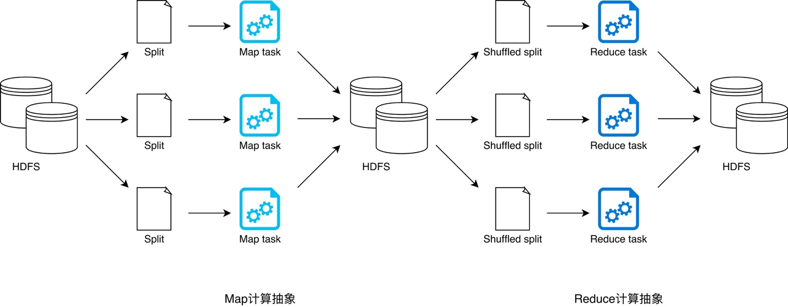
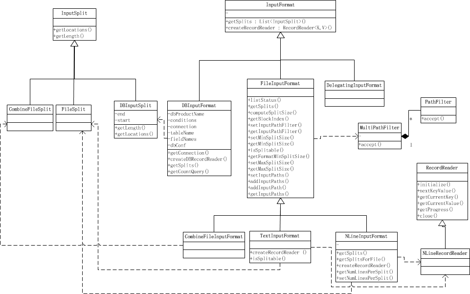
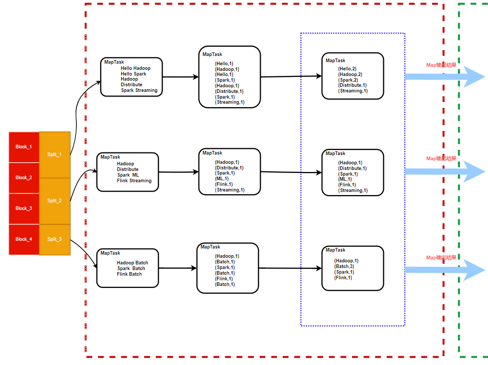

# 1. 什么是MapReduce

*内容引用：
[1] <https://mp.weixin.qq.com/s?__biz=MzIxMjE5MTE1Nw==&mid=2653193112&idx=1&sn=b645024ab20be4381cbc3f1a4ac4fbb5&chksm=8c99f142bbee7854fd4793c2c6753c4a945c160fa0e8eafebc82de04e5d0d95b62d554f57630&mpshare=1&scene=23&srcid=0209VrWmsvgg2Hto8hLbvbn6#rd>
[2] <https://www.cnblogs.com/laowangc/p/8961946.html>
[3] <https://blog.csdn.net/mrlevo520/article/details/76781186>*

---
MapReduce编程模型思想是Hadoop，Spark，Flink计算引擎的基石。
MapReduce是一种编程模型，其理论来自Google公司发表的三篇论文（MapReduce，BigTable，GFS）之一，主要应用于海量数据的并行计算。
MapReduce可以分成Map和Reduce两部分理解。Map阶段（映射过程）：把一组数据按照某种Map函数映射成新的数据。Reduce阶段（归约过程）：把若干组映射结果进行汇总并输出。从事大数据开发工作必须深入理解MapReduce。

# 2.MapReduce基本流程

MapReduce编程模型将分布式计算抽象为Map阶段和Recude阶段。对于Map阶段通常是进行转换操作，如果计算任务在数据本地执行，那么Map阶段的数据不需要进行跨分区执行。对于Reduce阶段需要将Map阶段输出的结果从远程节点进行跨分区传输，该过程可以理解为Shuffle。Shuffle是MapReduce计算中重要的概念，必须要深入理解。



MapReduce 提供两类计算抽象，即 Map 和 Reduce。Map 抽象用于封装数据映射逻辑，开发者通过实现其提供的 map 接口来定义数据转换流程；Reduce 抽象用于封装数据聚合逻辑，开发者通过实现 reduce 接口来定义数据汇聚过程。**Map 计算结束后，往往需要对数据进行分发才能启动 Reduce 计算逻辑来执行数据聚合任务，数据分发的过程称之为 Shuffle**。MapReduce 提供的分布式任务调度让开发者专注于业务逻辑实现，而无需关心依赖管理、代码分发等分布式实现问题。在 MapReduce 框架下，为了完成端到端的计算作业，Hadoop 采用 YARN 来完成分布式资源调度从而充分利用廉价的硬件资源，采用 HDFS 作为计算抽象之间的数据接口来规避廉价磁盘引入的系统稳定性问题。

*以上内容来自:<https://www.infoq.cn/article/oPpQzsJIFopeBpzVcbx7>*

# 3. MapReduce原理

关于MapReduce的原理主要分为三个部分:Map端,Shuffle,Reduce端。其中Shuffle最为重要，Shuffle可细分为Map端Shuffle和Reduce端Shuffle。


## 3.1 Map端

在MapReduce的Map端主要是通过InputFormat接口作为Map任务输入数据的入口，它提供了多种形式的数据输入方式如DBInputFormat(数据库)、FileInputFormat(文件)等,用户可根据需要自定义实现该接口。下图展示了InputFormat接口主要实现继承类：


*图片来源:<https://www.cnblogs.com/shitouer/archive/2013/02/28/hadoop-source-code-analyse-mapreduce-inputformat.html>*

在InputFormat的抽象接口中可以看到其主要的方法有：

```Java

/**
 * 返回数据集的逻辑切片列表 
 */
public abstract 
    List<InputSplit> getSplits(JobContext context
                               ) throws IOException, InterruptedException;

/**
 * 创建一个读取器用于读取一个切片。 
 */
public abstract 
    RecordReader<K,V> createRecordReader(InputSplit split,
                                         TaskAttemptContext context
                                        ) throws IOException, 
                                                 InterruptedException;
```

这里面有两个重要的概念：切片(Split)、读取器(RecordReader)。

* 切片
  **切片个数决定了Map任务的并行度**。
  Map任务并行度：Map在从HDFS上读取文件时默认以HDFS块大小作为一个切片，当然也可以配置切片大小。切片相对于文件块而言是一个逻辑划分(实际上HDFS是按照块进行物理存储的，默认情况下一个切分与文件块一一对应)，Map任务个数与切片个数是相同的，也就是说**切片个数决定了Map任务的并行度**。

* 读取器
  在每个Map任务中使用RecordReader来读取一个切片数据作为任务的输入数据，针对不同的Input数据使用专有的RecordReader来读取。

以常用的读取文本文件为例来说明。



FileInputFormat是常用的文件读取接口，在该抽象类中提供了一些模板方法供子类自定义实现，在该抽象类中默认实现了`getSplits`方法。该方法是文件切片的核心方法。其主要代码如下：

```java
public List<InputSplit> getSplits(JobContext job) throws IOException {
    
    /**
      * getFormatMinSplitSize: 方法默认返回值1.
      * getMinSplitSize: 通过配置项"mapreduce.input.fileinputformat.split.minsize"获取。
      * getMaxSplitSize: 通过配置项"mapreduce.input.fileinputformat.split.maxsize"获取。
      * 
      * Step1 : 获取一个切片的最大值和最小值。
      * 
      */
    long minSize = Math.max(getFormatMinSplitSize(), getMinSplitSize(job));
    long maxSize = getMaxSplitSize(job);
    

     /**
       * Step2：获取配置的输入数据路径的文件，路径可以文件亦可以是目录。
       */
    List<FileStatus> files = listStatus(job);

    /**
      * Step3: 循环遍历每个文件，将每个文件切分为逻辑大小的切片。
        在开始切分文件之前，事先说明一个切片包含的基本数据信息：文件路径，起始字节偏移量，切片字节数，主机列表。
        以一个文件切分为例说明：
        （1）先获取文件字节大小，逻辑切片大小按照字节数来计算。
        （2）如果文件大小为0，表示当前文件是空文件，那么将会创建一个空的切片，该切片的字节数为0，主机地址列表为空。
        （3）如果文件字节数大于0，表示文件不为空，开始执行第(4)步。
        （4）首先获取当前文件的Block信息，返回一个BlockLoction数组(一个文件存在多个Block)。
             （4.1）首先将判断给定的文件是否可切分，有的文件不支持切分，只能整块存储。
                    如果文件不能切分，那么将整个文件作为一个切片。(此时Block应该只有一块)
             （4.2）如果文件可以被切分，那么开始进行文件切分。
                   在进行文件切分时首先要确定切片的大小(之前只是确定了切片的最大值和最小值，并没有确定一个切片具体大小是多少)    。
                   切片大小计算的方式： 
                        max(minSize, min(maxSize, blockSize))
                    在获取到了一个切片具体的字节大小后，开始循环的对文件进行切分，这里有个细节需要注意，
                    当文件剩余字节(bytesRemaining)是切片字节的1.1倍时，如果大于1.1倍才开始进行下一轮的切分。
                    while(bytesRemaining)/splitSize > 1.1){
                        // 开始进行切片划分
                    }
                    当占比小于1.1倍时将剩余的文件作为一个切片，至此一个文件的切片结束了。开始进行下一个文件的切片。
                    
      */

    for (FileStatus file: files) {
      Path path = file.getPath();
      // 先获取文件字节大小，逻辑切片大小按照字节数来计算。
      long length = file.getLen();
      if (length != 0) {
        // 首先获取当前文件的Block信息，返回一个BlockLoction数组(一个文件存在多个Block)。 
        BlockLocation[] blkLocations;
        // 首先将判断给定的文件是否可切分
        if (isSplitable(job, path)) {
          // 确定切片的大小
          long splitSize = computeSplitSize(blockSize, minSize, maxSize);

          long bytesRemaining = length;
          // 在获取到了一个切片具体的字节大小后，开始循环的对文件进行切分，这里有个细节需要注意，
          // 当文件剩余字节(bytesRemaining)是切片字节的1.1倍时，如果大于1.1倍才开始进行下一轮的切分。
          while (((double) bytesRemaining)/splitSize > SPLIT_SLOP) {
            int blkIndex = getBlockIndex(blkLocations, length-bytesRemaining);
            splits.add(makeSplit(path, length-bytesRemaining, splitSize,
                        blkLocations[blkIndex].getHosts(),
                        blkLocations[blkIndex].getCachedHosts()));
            bytesRemaining -= splitSize;
          }
         // 当占比小于1.1倍时将剩余的文件作为一个切片.
          if (bytesRemaining != 0) {
            int blkIndex = getBlockIndex(blkLocations, length-bytesRemaining);
            splits.add(makeSplit(path, length-bytesRemaining, bytesRemaining,
                       blkLocations[blkIndex].getHosts(),
                       blkLocations[blkIndex].getCachedHosts()));
          }
        } else { 
          // 有的文件不支持切分，只能整块存储
          splits.add(makeSplit(path, 0, length, blkLocations[0].getHosts(),
                      blkLocations[0].getCachedHosts()));
        }
      } else { 
        //当前文件是空文件，那么将会创建一个空的切片，该切片的字节数为0，主机地址列表为空。
        splits.add(makeSplit(path, 0, length, new String[0]));
      }
    }
    return splits;
  }
```

针对上述的文件切片，当指定的目录中存在很多小文件时，每一个小文件将单独作为一个切片。那么显然对Map计算任务有很大影响，对于该种情形将使用`CombineFileInputFormat`这个接口来对小文件进行合并。

对于文件切片相对来说比较容易理解，那么接下来比较重要的是Map任务是如何读取切片呢?
对于切片读取主要通过`RecordReader`接口进行读取。针对于一个切片一个Map任务，Map将数据读取过来进行处理。

## 3.2 Shuffle

Shuffle是MapReduce的核心，其性能优化大部分时间都是在进行Shuffle进行优化，因此必须要彻底理解Shuffle的机制。

### 3.2.1 Map端Shuffle


Map端的Shuffle主要是为数据分发前做准备：（1）数据持久化。 （2）数据分区。
数据持久化：其主要是将Map的输出结果持久化到磁盘，因为Map认为在执行完成后进程可能被系统回收，因此数据需要持久化到磁盘供Reduce端进程来读取数据。
数据分区：根据分区器将数据分发到不同的Reduce节点进行处理。

（1）Map输出的结果会暂且放在一个**环形内存缓冲区**中（该缓冲区的大小默认为100M，由**io.sort.mb**配置参数控制）。当该缓冲区达到指定阈值快要溢出时（默认为缓冲区大小的80%，由**io.sort.spill.percent**配置参数控制），会在本地文件系统中创建一个溢出文件(Spill)，将该缓冲区中的数据写入这个文件。
> 环形缓冲区：其本质上是一个数组用于存放数据。

（2）在溢写到磁盘之前，需要进行一系列的处理：

* **分区**。首先根据reduce任务数，将数据按照key和指定的分区器(默认Hash分区),将数据划分到不同的分区，也就是一个reduce任务对应一个分区的数据。这样做是为了避免有些reduce任务分配到大量数据，而有些reduce任务却分到很少数据，甚至没有分到数据的尴尬局面。
* **排序**。针对每个分区内的数据采用快速排序算法进行排序。
* **Combiner**。如果此时设置了Combiner，将排序后的结果进行Combianer操作，这样做的目的是让尽可能少的数据写入到磁盘。
  > Combiner 也可称之为合并，但是此处需要与Merge做区分，通常说的Merge更多的是指合并分组(Group)。
  > 此外，并不是所有的计算都可以进行Combiner，Combiner可以看作是一个局部聚合，它要求经过Combiner操作后的结果对最终结果无影响(如求和、最大值等)。如果对最终的结果产生影响，那么Combiner是不能使用的(如均值计算)。

（3）Merge溢写文件。当Map任务输出最后一个记录时，可能会有很多的溢出文件，这时需要将这些文件**合并(Merge)**。Merge是指将多个溢写文件归并为一个文件，因为Map任务结束后会最终形成一个文件。多个溢写文件按照分区将文件进行归并，针对每个分区(来自不同的溢写文件)可能存在相同的key，那么相同的key的值将生成一个Group(组),类似于(key,[v1,v2])等。针对每个分区同样的需要对key进行排序，此时采用的算法是归并算法。
> 如果此时设定了Combiner，那么对于Group中的值也可以进行合并。

Map端的所有工作都已经结束，最终生成的这个文件也存放在TaskTracker够得到的某个本地目录中。每个reduce task不断地通过RPC从JobTRacker那获取map task是否完成的信息，如果reduce task得到通知，获知某台TaskTracker上的map task执行完成，Shuffle的后半段过程开始启动。

### 3.2.2 Reduce端Shuffle


Reduce端的Shuffle相对来说最为关键的是从Map输出结果文件进行数据读取。

（1）Copy数据。Reduce进程启动一些数据Copy线程（Fetcher），通过http方式请求Map Task所在的节点获取Map Task的输出文件。因为Map Task早已结束，这些文件就归TaskTracker管理在本地磁盘中。Reduce会接收到不同Map任务传来的数据，并且每个Map传来的数据都是**有序**的。如果reduce端接收的数据量相当小，则直接存储在内存中（缓冲区大小由**mapred.job.shuffle.input.buffer.percent**配置参数控制，表示用作此用途的堆空间百分比），如果数据量超过了该缓冲区大小的一定比例（由**mapred.job.shuffle.merg.percent**决定），则将内存缓冲区中的数据溢写到磁盘。
> 在从内存溢写到磁盘的过程中，与Map溢写磁盘的过程类似。需要对key进行**排序**，如果设定**Combiner**，那么在溢写时将执行Combiner操作。

（2）Merge溢写文件。随着溢写文件的增多，后台线程会将它们合并成一个更大的有序的文件，这样做是为了给后面的合并节省空间。此时需要注意的时，在进行归并多个溢写文件时，仍然会对key进行排序，但是此时会生成一个GroupComparator(分组),此时未进行Combiner操作。不断地Merge后，最后会生成一个“最终文件”。为什么加引号？因为这个文件可能存在于磁盘上，也可能存在于内存中，那么最终文件将直接作为输入传给了reduce函数。

## 3.3 Reduce端

在Reduce端其主要是进行reduce计算，将计算结果写入到外部存储系统(通常是写入到HDFS)。同样的，Hadoop同样提供了写入接口`OutputFormat`。在接口中主要是通过`RecordWriter`将结果输出到外部存储系统。
