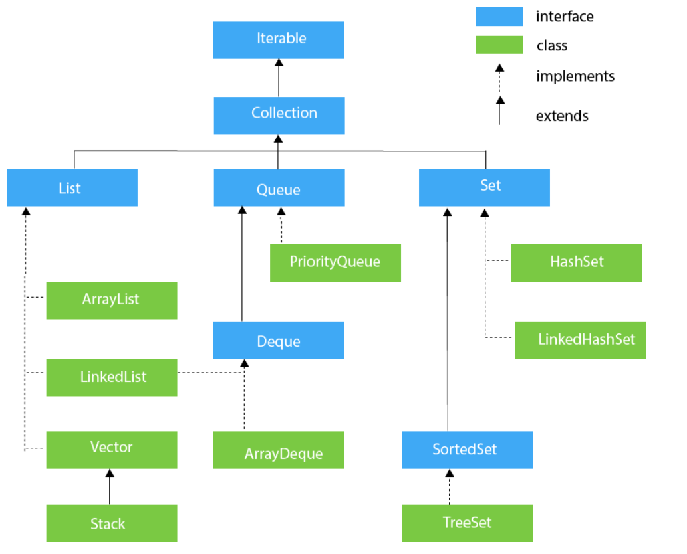

# Java

## 基础知识

- 平台无关性
  - [Java如何实现的平台无关性的](http://hollischuang.gitee.io/tobetopjavaer/#/basics/object-oriented/platform-independent?id=%e4%bb%80%e4%b9%88%e6%98%af%e5%b9%b3%e5%8f%b0%e6%97%a0%e5%85%b3%e6%80%a7)
- 多态、继承、封装
  - 什么是多态?动态多态(运行时动态绑定)与静态多态(函数重载)
    - [参考博文](http://hollischuang.gitee.io/tobetopjavaer/#/basics/object-oriented/polymorphism)
  - 方法重载与重写区别
    - [方法重写与重载](http://hollischuang.gitee.io/tobetopjavaer/#/basics/object-oriented/overloading-vs-overriding)
  - 为什么不支持多重继承？(菱形问题)
    - [Java为什么不支持多继承](http://hollischuang.gitee.io/tobetopjavaer/#/basics/object-oriented/multiple-inheritance)
  - 变量、类、方法的作用域
    - [成员变量和方法作用域](http://hollischuang.gitee.io/tobetopjavaer/#/basics/object-oriented/scope)
  - 为什么Java是值传递？可从求值策略角度分析。
    - [值传递、引用传递](http://hollischuang.gitee.io/tobetopjavaer/#/basics/object-oriented/java-pass-by)
    - [为什么说Java中只有值传递](http://hollischuang.gitee.io/tobetopjavaer/#/basics/object-oriented/why-pass-by-reference)
- 基本数据类型
  - Java中为什么byte类型的取值范围为-128~127？
    - [Java中，为什么byte类型的取值范围为-128~127? - CSDN博客](https://blog.csdn.net/qq_23418393/article/details/57421688)
  - 自动拆箱与装箱(基本类型的包装类)
    - [自动拆装箱](http://hollischuang.gitee.io/tobetopjavaer/#/basics/java-basic/boxing-unboxing)
  - Integer的缓存机制
    - [Integer的缓存机制](http://hollischuang.gitee.io/tobetopjavaer/#/basics/java-basic/integer-cache)
- String
  - JDK1.6与JDK1.7后substring方法的区别？
    - [JDK 6和JDK 7中substring的原理及区别](http://hollischuang.gitee.io/tobetopjavaer/#/basics/java-basic/substring)
  - 字符串的几种拼接方式？(concat,StringBuffer,StringBuilder,+)
    - [字符串拼接的几种方式和区别](http://hollischuang.gitee.io/tobetopjavaer/#/basics/java-basic/string-concat)
  - int类型转换为字符串的三种方式?
    - [String.valueOf和Integer.toString的区别](http://hollischuang.gitee.io/tobetopjavaer/#/basics/java-basic/value-of-vs-to-string)
  - String的intern方法
    - [intern方法](http://hollischuang.gitee.io/tobetopjavaer/#/basics/java-basic/intern)
  - String是否存在长度限制？
    - [String有没有长度限制？](http://hollischuang.gitee.io/tobetopjavaer/#/basics/java-basic/length-of-string)
- 关键字
  - switch关键字原理
    - [switch对String的支持](http://hollischuang.gitee.io/tobetopjavaer/#/basics/java-basic/switch-string)
  - transient关键字
    - [transient](http://hollischuang.gitee.io/tobetopjavaer/#/basics/java-basic/transient-in-java)
  - static 关键字
    - [关于Java的静态：静态类、静态方法、静态变量、静态块等](https://zhuanlan.zhihu.com/p/26819685)
  
## 集合类

引用：<https://www.javatpoint.com/collections-in-java>

- Collection和Collections区别?
  - [Collection和Collections区别](http://hollischuang.gitee.io/tobetopjavaer/#/basics/java-basic/Collection-vs-Collections)
- Set,List,Map接口的区别?
  - [Set和List区别？](http://hollischuang.gitee.io/tobetopjavaer/#/basics/java-basic/set-vs-list)
  - [三大集合：List、Map、Set的区别与联系](https://blog.csdn.net/yangxingpa/article/details/81023138?utm_medium=distribute.pc_relevant_t0.none-task-blog-2%7Edefault%7EBlogCommendFromMachineLearnPai2%7Edefault-1.control&dist_request_id=&depth_1-utm_source=distribute.pc_relevant_t0.none-task-blog-2%7Edefault%7EBlogCommendFromMachineLearnPai2%7Edefault-1.control)
- List 接口
  - ArrayList和LinkedList和Vector的区别
    >分析要点：
    >1.数据结构角度,插入删除元素位置的影响
    >2.扩容角度
    >3.线程安全性角度
    >4.内存占用空间
    >5.快速随机访问
    - [Arraylist 与 LinkedList 区别?](https://github.com/Snailclimb/JavaGuide/blob/master/docs/java/collection/ArrayList%E6%BA%90%E7%A0%81%2B%E6%89%A9%E5%AE%B9%E6%9C%BA%E5%88%B6%E5%88%86%E6%9E%90.md#12-arraylist-%E4%B8%8E-linkedlist-%E5%8C%BA%E5%88%AB)
    - [Arraylist 和 Vector 的区别?](https://github.com/Snailclimb/JavaGuide/blob/master/docs/java/collection/ArrayList%E6%BA%90%E7%A0%81%2B%E6%89%A9%E5%AE%B9%E6%9C%BA%E5%88%B6%E5%88%86%E6%9E%90.md#11-arraylist-%E5%92%8C-vector-%E7%9A%84%E5%8C%BA%E5%88%AB)
    - [ArrayList和LinkedList和Vector的区别](http://hollischuang.gitee.io/tobetopjavaer/#/basics/java-basic/arraylist-vs-linkedlist-vs-vector)
  - SynchronizedList和Vector同样线程安全,有什么区别？
    - [SynchronizedList和Vector的区别](http://hollischuang.gitee.io/tobetopjavaer/#/basics/java-basic/synchronizedlist-vector) 
  - ArrayList扩容机制分析
    - [ArrayList 扩容机制分析](https://github.com/Snailclimb/JavaGuide/blob/master/docs/java/collection/ArrayList%E6%BA%90%E7%A0%81%2B%E6%89%A9%E5%AE%B9%E6%9C%BA%E5%88%B6%E5%88%86%E6%9E%90.md#3-arraylist-%E6%89%A9%E5%AE%B9%E6%9C%BA%E5%88%B6%E5%88%86%E6%9E%90)
- Map接口
- Set接口
- Queue接口

## 枚举与注解

## IO流

## 反射

## 泛型

## 异常机制

- Exception
  
- Error

## 其他

- 序列化与反序列化

- API与SPI

  